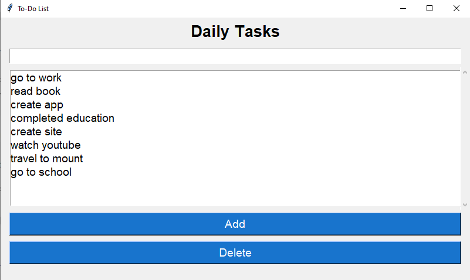
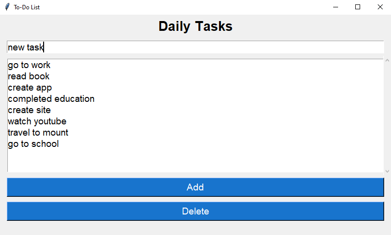
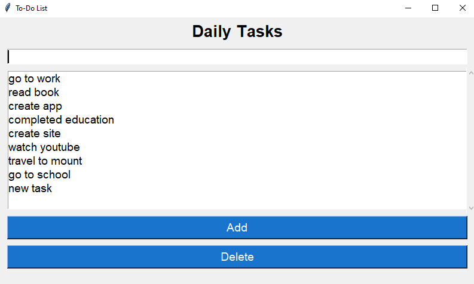
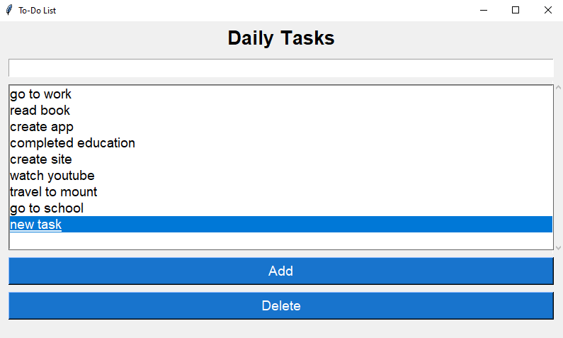
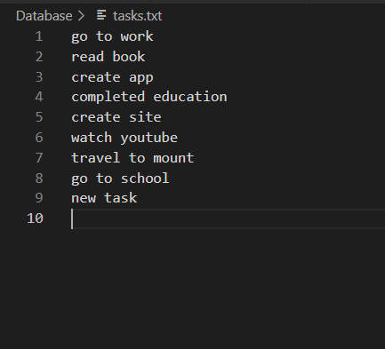
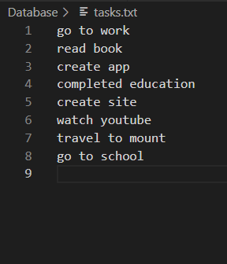

# Описание работы программы

Программа создана для работы со списком задач. Имеет графический интерфейс и позволяет осуществлять следующие функции: 
* Хранение списка задач
* Добавление новых задач
* Удаление существующих задач

Хранение данных происходит в текстовом файле, который создается и хранится в папке программы.

При запуске программы, выводится список задач, если существует.

# Структура программы

Пользователь взаимодействует с интерфейсом программы, который в свою очередь в зависимости от того, какие кнопки нажимаются, производит:
> Добавление новых задач

> Удаление существующих задач

> Сохранение всех изменений в файл списка задач

